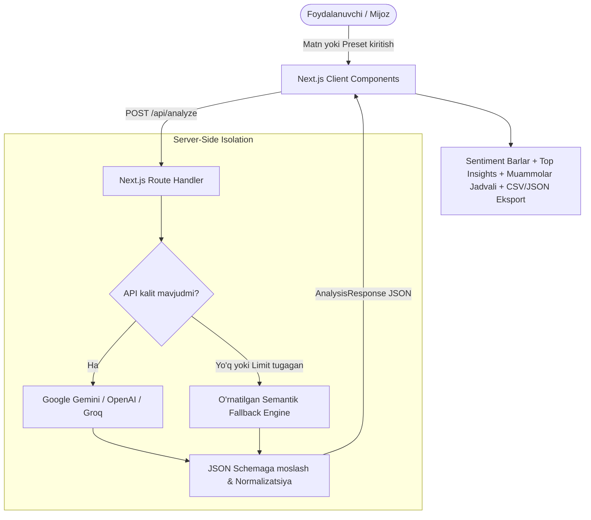

# Customer Feedback AI Intelligence

[](https://nextjs.org/)
[](https://www.typescriptlang.org/)
[](https://tailwindcss.com/)
[](https://vitest.dev/)
[](#)

> **Mijozlarning tarqoq matnli fikrlarini (feedback) sun'iy intellekt orqali chuqur tahlil qilib, sentiment taqsimoti, 3 ta top strategik xulosa va ustuvor muammo-yechimlar harakat rejasiga (action plan) aylantiruvchi production-ready Next.js SaaS platformasi.**
>
> *Production-ready Customer Feedback Intelligence SaaS platform that transforms unstructured customer reviews into quantifiable sentiment metrics, top 3 strategic insights, and an actionable Problem-Solution roadmap.*

---

## 🌐 Tillarni tanlash / Languages
- [O'zbekcha Yo'riqnoma](#-ozbekcha-hujjatlashtirish)
- [English Documentation](#-english-documentation)

---

## 🇺🇿 O'zbekcha Hujjatlashtirish

### 📌 Loyiha haqida va Muammoning Dolzarbligi
Zamonaviy bizneslar (SaaS, E-commerce, FinTech, xizmat ko'rsatish) har kuni yuzlab turli kanallardan mijoz fikrlarini qabul qiladi. Ushbu fikrlarni qo'lda o'qish, tahlil qilish va saralash:
- **Soatlab qimmatli vaqtni oladi**;
- **Muhim tizimli muammolar (masalan, to'lov xatolari yoki kuryer kechikishi) e'tibordan chetda qolishiga olib keladi**;
- **Mijozlarning ketib qolishiga (churn) sabab bo'ladi**.

**Customer Feedback AI Intelligence** bir necha soniya ichida mijoz fikrlarini qayta ishlaydi, raqamli metrikalarga aylantiradi va jamoaga zudlik bilan bajarilishi kerak bo'lgan vazifalar ro'yxatini taqdim etadi.

---

### ✨ Asosiy Xususiyatlar (Key Features)

1. **Semantik Sentiment Tahlil**:
   - Ijobiy (Positive), Neytral (Neutral) va Salbiy (Negative) foizlarining aniq taqsimoti (yig'indisi doimo 100%).
   - Sog'lomlik indeksi (Customer Health Score) kalkulyatori.
2. **Top 3 Strategik Xulosa (Top 3 Insights)**:
   - Biznes qarorlari qabul qilish uchun eng zarur 3 ta ustuvor xulosa va ularning ta'siri (Impact).
3. **Muammo | Ustuvorlik | Amaliy Yechim Jadvali**:
   - Tizimli muammolarni aniqlash va ularni `High`, `Medium`, `Low` darajalari bo'yicha saralash.
   - Har bir muammo uchun dasturchilar yoki menejerlar darhol qo'llashi mumkin bo'lgan yechim tavsiyasi.
   - Ustuvorlik darajasi bo'yicha tezkor filtrlash (Barchasi, Yuqori, O'rta, Past).
4. **4 ta Real Sanoat Preseti (Industry Presets)**:
   - 1-bosish bilan E-Commerce, B2B SaaS, FinTech yoki Restoran servislari namunalarini yuklash.
5. **Eksport va Ulashish**:
   - Natijalarni **CSV** (jadval) yoki **JSON** formatida bir zumda yuklab olish.
   - Tahlil xulosasini buferga (clipboard) nusxalash.
6. **Zero AI-Slop Dizayn**:
   - Ortiqcha shovqinsiz, toza ma'lumotlar ierarxiyasi, Inter/Geist tipografiyasi, neytral slate/zinc ranglar palitrasi.
7. **Zero-Config Resilient Fallback Engine**:
   - Tashqi AI kalitlar berilmagan taqdirda ham o'rnatilgan semantik tahlil algoritmi 100% oflayn ishlaydi. Portfolio namoyishida hech qachon 500 error yoki oq ekran bo'lmaydi!

---

### 🛠 Texnologiyalar Steki

- **Frontend & Full-stack**: [Next.js 14 (App Router)](https://nextjs.org/)
- **Dasturlash tili**: [TypeScript 5](https://www.typescriptlang.org/)
- **Stillashtirish**: [Tailwind CSS](https://tailwindcss.com/)
- **Ikonkalar**: [Lucide React](https://lucide.dev/)
- **AI Integratsiyasi**: Server-side Google Gemini Flash/Pro, OpenAI GPT-4o-mini, Groq Llama 3 & Built-in Deterministic Fallback Engine
- **Testlash (Testing)**: [Vitest](https://vitest.dev/)
- **Deploy**: [Vercel](https://vercel.com/)

---

### 🏗 Arxitektura va Ma'lumotlar Oqimi



---

### 🚀 Mahalliy O'rnatish va Ishga Tushirish (Local Run)

#### 1. Repozitoriyani klonlash
```bash
git clone https://github.com/your-username/customer-feedback-ai.git
cd customer-feedback-ai
```

#### 2. Bog'liqliklarni o'rnatish
```bash
npm install
```

#### 3. Muhit o'zgaruvchilari (Ixtiyoriy)
Nusxa oling:
```bash
cp .env.example .env.local
```
> **Eslatma**: API kalit kiritmasangiz ham dastur to'liq ishlaydi. Agar Gemini yoki OpenAI ishlatmoqchi bo'lsangiz, tegishli kalitni `.env.local` ga yozing.

#### 4. Dasturni ishga tushirish
```bash
npm run dev
```
Brauzerda [http://localhost:3000](http://localhost:3000) manzilini oching.

---

### 🧪 Testlash va Production Build

```bash
# Avtomatlashtirilgan unit va E2E testlarni ishga tushirish
npm test

# Production build qilish (kompilyatsiya va statik sahifalarni tekshirish)
npm run build

# Production serverini ishga tushirish
npm start
```

---

### ☁️ Vercel'ga Joylashtirish (Deploy to Vercel)

Loyiha Vercel platformasi uchun 100% optimallashtirilgan bo'lib, `vercel.json` konfiguratsiya faylini o'z ichiga oladi.

#### Variant A: Vercel Dashboard (1-Click)
1. Kodni GitHub repozitoriyangizga push qiling.
2. [Vercel Dashboard](https://vercel.com/new) ga kiring va repozitoriyani import qiling.
3. **Environment Variables** bo'limida kerak bo'lsa `GEMINI_API_KEY` yoki `OPENAI_API_KEY` ni kiriting (ixtiyoriy).
4. **Deploy** tugmasini bosing.

#### Variant B: Vercel CLI orqali
```bash
npm i -g vercel
vercel
```

---

### 🔒 Xavfsizlik Kafolati (Security & Privacy)
- **API Kalitlar Xavfsizligi**: Barcha tashqi AI API kalitlar faqat server-side (`/api/analyze`) muhitida saqlanadi. Ular hech qachon brauzer brauzer paketiga (`NEXT_PUBLIC_` orqali) oshkor qilinmaydi.
- **Ma'lumotlar Maxfiyligi**: Foydalanuvchi ma'lumotlari uchinchi tomon ma'lumotlar bazalarida ruxsatsiz saqlanmaydi.

---
---

## 🇬🇧 English Documentation

### 📌 Overview & Value Proposition
Customer-facing teams receive fragmented feedback across reviews, emails, and support tickets daily. Manually parsing these takes hours, leading to delayed fixes, unresolved user frustration, and preventable churn.

**Customer Feedback AI Intelligence** is an enterprise-grade Next.js application that parses unstructured feedback, quantifies sentiment, extracts the top 3 strategic insights, and generates a prioritized **Problem | Priority | Solution** roadmap within seconds.

---

### ✨ Features
- **Deterministic & LLM Sentiment Distribution**: Granular Positive / Neutral / Negative breakdown guaranteed to sum to 100%.
- **Top 3 Strategic Insights**: Clear, high-impact business takeaways with severity badging.
- **Actionable Problem-Solution Matrix**: Auto-categorizes system bottlenecks into `High`, `Medium`, and `Low` urgency with engineer-ready mitigation advice.
- **Interactive Filtering & Export**: Filter by priority level; 1-click export to **CSV** and **JSON**; copy report to clipboard.
- **4 Real-World Presets**: Instant evaluation with real E-Commerce, B2B SaaS, FinTech, and Restaurant use cases.
- **Zero AI-Slop Design Language**: Monospaced accents, crisp typography, 1px subtle borders, high information density.
- **Fail-Safe Built-in Engine**: Works offline out-of-the-box without requiring an API key (0% downtime guarantee for portfolio demonstrations).

---

### 📦 Tech Stack
- **Framework**: Next.js 14 (App Router)
- **Language**: TypeScript 5.6
- **Styling**: Tailwind CSS 3.4
- **Icons**: Lucide React
- **AI Models**: Google Gemini 1.5, OpenAI GPT-4o-mini, Groq Llama 3.1 & In-Memory Semantic Engine
- **Test Runner**: Vitest 2.1
- **Platform**: Vercel

---

### 🚀 Quick Start

```bash
# 1. Clone repository
git clone https://github.com/your-username/customer-feedback-ai.git
cd customer-feedback-ai

# 2. Install dependencies
npm install

# 3. Configure environment (Optional)
cp .env.example .env.local

# 4. Start local development server
npm run dev
```

Visit [http://localhost:3000](http://localhost:3000) in your browser.

---

### 🧪 Quality Assurance & Build Verification

```bash
# Run unit, contract, and end-to-end workflow tests
npm test

# Verify production build compilation
npm run build
```

---

### 🚢 Deployment
Deploy directly to Vercel with zero configuration required. The repository includes an optimized `vercel.json` with recommended API cache controls.

```bash
vercel --prod
```

---

## 📄 License
This project is licensed under the MIT License.
